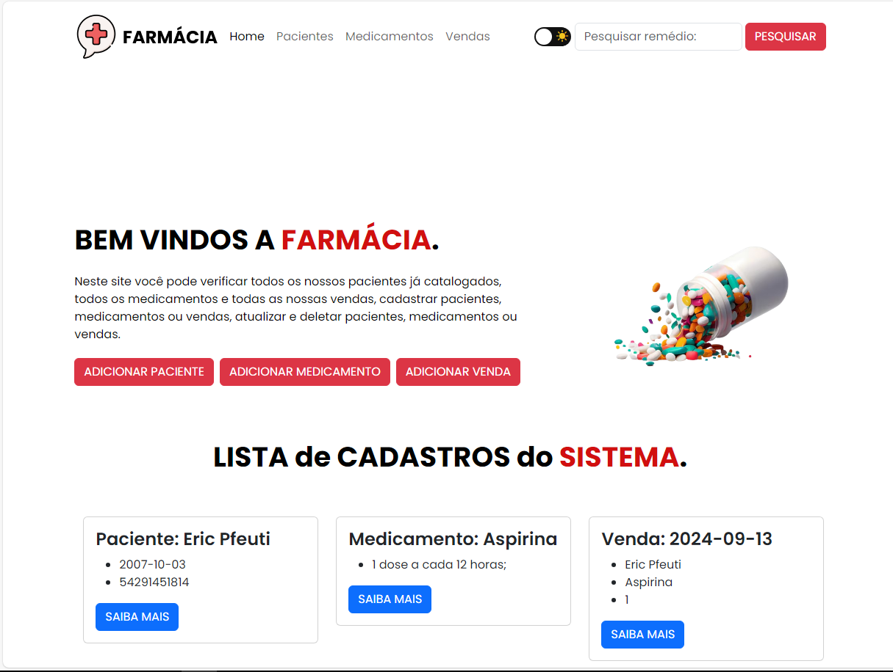

# MongoDB com NodeJS

## Olá! Criei esta API com um Banco de Dados para uma avaliação escolar utilizando BootStrap, sendo ela um sistema de Farmácia e nela você pode: 
- Adicionar pacientes/medicamentos/vendas; 
- Excluir pacientes/medicamentos/vendas; 
- Pesquisar medicamentos por nome; 
- Verficar todos os pacientes/medicamentos/vendas nesta API em formato de tabela; 
- Você pode também testar a versão para mobile; 
- Você pode também pode mudar o tema de branco para escuro; 
- Entre outros; 

## Linguagens que utilizei para fazer esta API:

    
    
    
    
    

 
